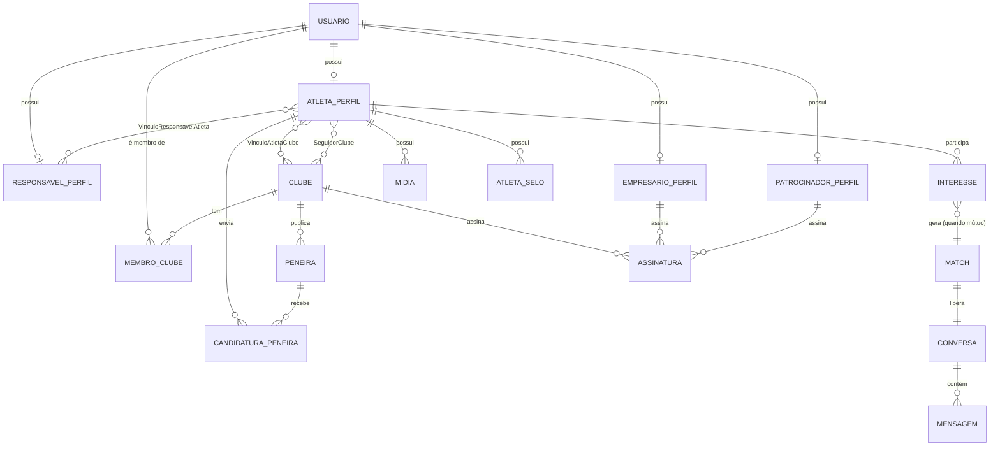

# 03 — Modelo de Domínio e Esquema do Banco (MVP · Vôlei)

> Depende de `docs/02-prd-mvp.md`. Cobre entidades, relações, RBAC de clube
> e o tratamento de menores/responsável legal, conforme decisões já
> fechadas na descoberta e no PRD. Este é o modelo **conceitual** — o
> schema Prisma exato (tipos, índices, constraints) é detalhe de
> implementação a refinar quando começarmos a codar, não decisão de
> arquitetura em si.

---

## 1. Princípios do modelo

- **Usuario (autenticação) é separado de Perfil (persona).** Uma pessoa loga
  como `Usuario`; o que ela pode fazer depende de qual(is) perfil(is) esse
  usuário tem — hoje um usuário tem exatamente um perfil de persona
  (Atleta, Responsável, Empresário ou Patrocinador) **ou** é membro de um ou
  mais Clubes. Isso evita duplicar lógica de auth por persona.
- **Vínculo Atleta↔Clube e Atleta↔Responsável são muitos-para-muitos**,
  conforme decidido no PRD (§7) — um atleta pode estar em mais de um clube,
  e pode ter mais de um responsável (pai e mãe, por exemplo).
- **Visibilidade do perfil de menor é um estado derivado, não um campo
  manual.** `AtletaPerfil.status_visibilidade` é calculado a partir de
  idade + existência de ao menos um vínculo de responsável `APROVADO`
  (RN-01) — nunca editável diretamente pelo atleta.
- **RBAC de clube é um papel por vínculo, não um papel global do usuário**
  (`MembroClube.papel`) — a mesma pessoa pode, em tese, ser membro de dois
  clubes com papéis diferentes em cada um.

---

## 2. Entidades

### 2.1 Identidade e acesso

**Usuario** — conta de login (e-mail/senha ou OAuth Google).
- `id`, `email`, `senha_hash` (nullable se OAuth), `oauth_provider`
  (nullable), `telefone`, `criado_em`, `ativo`.

### 2.2 Atleta e responsável (núcleo de LGPD/menores)

**AtletaPerfil** (1:1 com Usuario)
- `id`, `usuario_id`, `nome`, `data_nascimento`, `sexo`, `cidade`, `estado`,
  `altura_cm`, `envergadura_cm`, `alcance_ataque_cm`, `alcance_bloqueio_cm`,
  `posicao` (enum: PONTEIRO, LEVANTADOR, CENTRAL, LIBERO, OPOSTO),
  `categoria` (enum: SUB13, SUB15, SUB17, SUB19, ADULTO — derivável da
  idade, mas armazenada para permitir ajuste manual em casos de borda),
  `bio`, `status_visibilidade` (enum: PENDENTE_APROVACAO, VISIVEL, OCULTO),
  `criado_em`.
- `is_menor` é derivado de `data_nascimento`, não armazenado.

**ResponsavelPerfil** (1:1 com Usuario)
- `id`, `usuario_id`, `nome`, `cpf`, `telefone`.

**VinculoResponsavelAtleta** (N:N entre Responsável e Atleta — o gate de
RN-01)
- `id`, `responsavel_id`, `atleta_id`, `status` (enum: PENDENTE, APROVADO,
  REVOGADO), `tipo_relacao` (PAI, MAE, TUTOR_LEGAL), `solicitado_em`,
  `respondido_em`.
- Campos de auditoria de consentimento (ver `docs/04-seguranca-lgpd.md`
  §4): `versao_termo_aceito`, `ip_aprovacao`, `user_agent_aprovacao` —
  necessários para comprovar o que foi consentido, quando, e por quem.
- Regra derivada: `AtletaPerfil.status_visibilidade = VISIVEL` **somente
  se** existir ≥1 registro `APROVADO` para aquele atleta **e** o gate de
  menor (§5, revisado) não estiver mais ativo — aplicada em tempo de
  leitura/consulta, não copiada como campo solto para evitar
  inconsistência.
- Adultos (18+) não precisam de vínculo aprovado para ficar visíveis, mas o
  vínculo pode existir historicamente (ex.: foi aprovado aos 16, hoje tem
  19) — mantido para auditoria, não removido ao atingir maioridade.

### 2.3 Empresário e Patrocinador

**EmpresarioPerfil** (1:1 com Usuario)
- `id`, `usuario_id`, `nome`, `documento`, `representa` (texto livre ou
  clube/agência), `status_verificacao` (enum: PENDENTE, APROVADO,
  REJEITADO — RN-03).

**PatrocinadorPerfil** (1:1 com Usuario)
- `id`, `usuario_id`, `razao_social`, `cnpj`, `status_verificacao`
  (mesmo enum acima).

### 2.4 Clube e RBAC multi-usuário

**Clube**
- `id`, `nome_fantasia`, `documento` (CNPJ; nullable no MVP — escolas de
  base como a JF Vôlei podem não ter CNPJ formal ainda), `cidade`,
  `estado`, `status_verificacao` (RN-03), `criado_em`.

**MembroClube** (N:N entre Usuario e Clube, com papel — RBAC, RN-04)
- `id`, `usuario_id`, `clube_id`, `papel` (enum MVP: ADMIN, MEMBRO — os 4
  papéis do CLAUDE.md ficam para V1, ver ADR de RBAC na etapa 4), `ativo`,
  `convidado_em`.

**VinculoAtletaClube** (N:N entre Atleta e Clube — muitos-para-muitos
confirmado no PRD)
- `id`, `atleta_id`, `clube_id`, `tipo_vinculo` (enum: ESCOLA_BASE,
  SELECAO, CLUBE_BASE_PROFISSIONAL), `status` (ATIVO, ENCERRADO),
  `data_inicio`, `data_fim` (nullable), `confirmado_pelo_clube` (bool —
  vira o selo "vínculo de clube confirmado").

### 2.5 Peneiras, candidaturas e descoberta (RN-08)

**Peneira**
- `id`, `clube_id`, `titulo`, `categoria`, `posicao_alvo` (nullable),
  `data_evento`, `local`, `descricao`, `status` (ABERTA, ENCERRADA),
  `criado_em`.

**CandidaturaPeneira**
- `id`, `peneira_id`, `atleta_id`, `status` (INTERESSADO, EM_AVALIACAO,
  APROVADO, REPROVADO), `criado_em`.

**SeguidorClube** (N:N entre Atleta e Clube — mecanismo de RN-08)
- `id`, `atleta_id`, `clube_id`, `criado_em`.
- Ao criar uma `Peneira`, o sistema notifica atletas que seguem o clube e
  cuja `categoria`/`posicao` combinam com a peneira.

**Notificacao**
- `id`, `usuario_id`, `tipo` (NOVA_PENEIRA, PROPOSTA, MATCH,
  APROVACAO_PENDENTE, APROVACAO_CONFIRMADA), `referencia_id`, `lida`,
  `criado_em`.

### 2.6 Interesse, match e conversa

**Interesse**
- `id`, `atleta_id`, `ator_tipo` (CLUBE, EMPRESARIO, PATROCINADOR),
  `ator_id`, `direcao` (ATOR_PARA_ATLETA, ATLETA_PARA_ATOR), `criado_em`.
- Um `Match` é criado quando existe `Interesse` nas duas direções para o
  mesmo par (atleta, ator).

**Match**
- `id`, `atleta_id`, `ator_tipo`, `ator_id`, `criado_em`.

**Conversa** (1:1 com Match)
- `id`, `match_id`, `criado_em`.

**Mensagem**
- `id`, `conversa_id`, `autor_usuario_id`, `conteudo`, `criado_em`.
- Regra de autorização (RN-02, não é FK): se o atleta da conversa é menor,
  todo `ResponsavelPerfil` com vínculo `APROVADO` para aquele atleta tem
  acesso de leitura a `Mensagem` — aplicado na camada de autorização, não
  no schema. Novo `Match`/`Conversa` envolvendo menor dispara `Notificacao`
  imediata ao(s) responsável(is) (`docs/04-seguranca-lgpd.md` §8).

**Denuncia** (moderação e prevenção de abuso — `docs/04-seguranca-lgpd.md`
§7)
- `id`, `denunciante_usuario_id`, `entidade_tipo` (PERFIL, MIDIA,
  MENSAGEM), `entidade_id`, `motivo`, `status` (ABERTA, EM_ANALISE,
  RESOLVIDA), `criado_em`.

### 2.7 Mídia, selos e gamificação

**Midia**
- `id`, `atleta_id`, `tipo` (VIDEO), `url`, `descricao`,
  `status_moderacao` (PENDENTE, APROVADA, REJEITADA), `criado_em`.

**Selo** (catálogo fixo no MVP)
- `id`, `codigo` (PERFIL_COMPLETO, VIDEO_ENVIADO, VINCULO_CLUBE_CONFIRMADO,
  RESPONSAVEL_VALIDADO), `nome`, `descricao`.

**AtletaSelo**
- `atleta_id`, `selo_id`, `concedido_em`.

### 2.8 Monetização

**Assinatura**
- `id`, `titular_tipo` (CLUBE, EMPRESARIO, PATROCINADOR — atleta não
  assina nada no MVP, RN-07), `titular_id`, `plano` (GRATIS, PREMIUM),
  `status` (ATIVA, CANCELADA, EXPIRADA), `criado_em`, `expira_em`.

---

## 3. Diagrama (entidades principais)

*(Diagrama simplificado — omite `Selo` como catálogo estático e o detalhe
de `ator_tipo` polimórfico em `Interesse`/`Match`, já descritos no texto.)*

---

## 4. RBAC de clube (RN-04, detalhado)

| Papel (MVP) | Pode | Não pode |
|---|---|---|
| **ADMIN** | Convidar/remover membros, publicar/editar peneiras, ver e gerenciar candidaturas, configurar dados do clube, assinar/cancelar plano | — |
| **MEMBRO** | Buscar atletas, ver e avaliar candidaturas de peneiras existentes | Convidar/remover membros, editar dados do clube, gerenciar assinatura |

V1 evolui `MEMBRO` em 3 papéis (treinador, olheiro, coordenador), cada um
com um subconjunto diferente de permissões de avaliação — adiado porque, com
1 clube piloto, não há ainda um caso real que exija essa granularidade.

---

## 5. Tratamento de menores — resumo do fluxo de dados

1. Atleta se cadastra → `AtletaPerfil.status_visibilidade = PENDENTE_APROVACAO`
   se menor (idade calculada de `data_nascimento`) **ou** se vinculado a
   uma categoria de base (sub-13 a sub-19) sem confirmação de maioridade
   pelo clube (regra reforçada em `docs/04-seguranca-lgpd.md` §5, para
   mitigar o risco de idade autodeclarada falsa).
2. Atleta informa contato do responsável → cria-se `VinculoResponsavelAtleta`
   com `status = PENDENTE` → `Notificacao` disparada para o responsável
   (que pode precisar criar `Usuario` + `ResponsavelPerfil` primeiro, se
   ainda não tiver conta).
3. Responsável aprova (registrando `versao_termo_aceito`, `ip_aprovacao`,
   `user_agent_aprovacao` — `docs/04-seguranca-lgpd.md` §4) →
   `VinculoResponsavelAtleta.status = APROVADO` → próxima leitura do perfil
   recalcula `status_visibilidade = VISIVEL`.
4. A partir daí, `ResponsavelPerfil` ganha acesso de leitura a toda
   `Mensagem` de `Conversa` envolvendo aquele atleta (RN-02), e é
   notificado a cada novo `Match`/`Conversa` envolvendo o menor.
5. Responsável pode setar `VinculoResponsavelAtleta.status = REVOGADO` a
   qualquer momento → perfil volta a `OCULTO` na próxima leitura.

**Risco residual, mitigado mas não eliminado:** para atletas sem vínculo
de clube confirmado (cadastro orgânico fora do piloto), a idade
autodeclarada continua sendo o único sinal — ver detalhamento e plano de
evolução em `docs/04-seguranca-lgpd.md` §5.

---

## 6. Perguntas abertas para a etapa 4 (ADRs)

- `Interesse`/`Match`/`Assinatura` usam `ator_tipo`/`titular_tipo`
  polimórfico (um campo enum + id, sem FK de banco de fato) — isso é
  pragmático no MVP com poucos tipos, mas é uma escolha de trade-off
  (perde integridade referencial no schema) que vale registrar como ADR
  quando decidirmos o schema Prisma exato.
- Notificação (`Notificacao`) é só um registro no banco lido por polling,
  ou precisa de tempo real (WebSocket) já no MVP? Isso conecta direto com
  a validação da stack (`CLAUDE.md` §4), a ser feita na etapa de ADRs.
